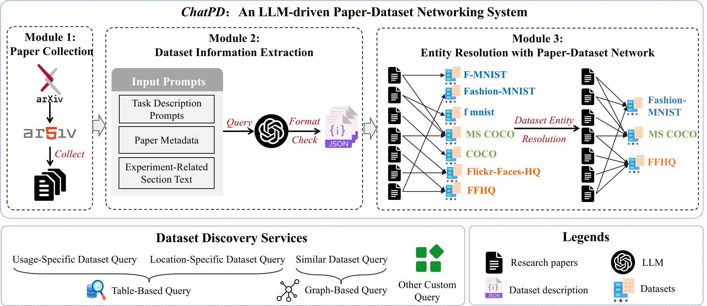

# ChatPD

Here is the code repo for the paper "ChatPD: An LLM-driven Paper-Dataset Networking System".

Our system use Large Language Model (LLM) to extract the dataset information from the academic papers and build the network between the papers and datasets to help the dataset discovery.

## System Architecture

The system architecture is shown as follows:

## How to run

